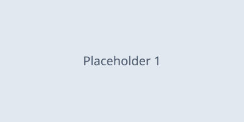

# Refund Policy

We refund purchases within **30 days** of the transaction date, provided:

- The item was purchased directly through the app store
- You haven't already redeemed the associated in-game item
- The request is made from the *original* purchasing account

To request a refund, contact support with your order ID. Refunds older than
30 days are handled on a `case-by-case` basis — see the escalation runbook
for details.

> Note: refunds do **not** reverse achievement or leaderboard progress.
